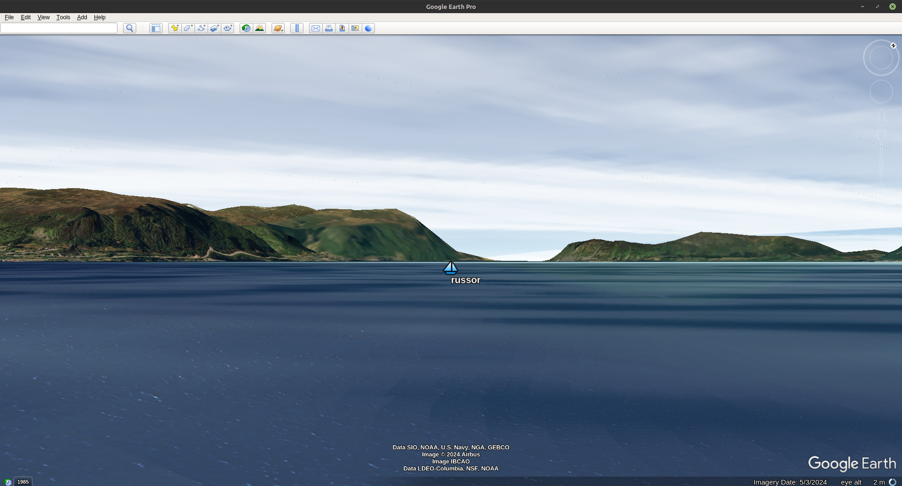

# Virtual Regatta Google Earth View

Realistic 3D look for the [Virtual Regatta](https://www.virtualregatta.com/en/offshore-game/).
Especially fine for shore views.

This progect uses [A Tool for Building Expert Systems CLIPS](https://www.clipsrules.net/), 
[Google Earth program](https://www.google.com/earth/about/versions/#earth-pro) and
Chrome browser with
[VR Dashboard plugin](https://chrome.google.com/webstore/search/VR%20Dashboard)

[](https://www.youtube.com/watch?v=-mU8IFLJL6w)
Click the screenshot to see a video!

## Prerequisites

You need to be installed on your machine:

1. Chrome browser.

2. [VR Dashboard plugin](https://chromewebstore.google.com/search/VR%20Dashboard%20I.T.Y.C.)

3. Python3.
	Simplest way to install python is by installing Python IDE [Thonny](https://thonny.org/)
	Alternatively for Windows please check the Microsoft App store or download the installer [here](https://www.python.org/downloads/windows/).
    The location of python.exe will be determined using PATH variable.
    For others platforms please follow the instructions for your OS or download the tarball [here](https://www.python.org/downloads/).

## Installation and usage

Download VRGoogleEarthView project from the Github using an OS command "git clone https://github.com/rururu/VRGoogleEarthView.git " or click a button "Code" on this page and unzip somewhere. Then:

1. Open "Virual Regatta" page in a browser.
2. Activate "VR Dashboard" plugin.
3. Enter into the race.
4. Allow a file run.sh (run.bat for Windows) to be executable (if needed).
5. Start VRGoogleEarthView program:

```shell
$ cd <..>/VRGoogleEarthView
$ ./run.sh       # Linux, MacOS
$ run.bat        # Windows (replace python.exe in this file in accordance with your python installation)
```
6. Start Google Earth program.
7. Open Google Earth View -> Sidebar (if needed).
8. Open cd <..>/VRGoogleEarthView/LinkToCamera.kml file.
9. Open cd <..>/VRGoogleEarthView/LinkToFleet.kml file and wait..

#### Note:

1. You may need to install some Python libraries before the first run! To do this:

```shell
$ pip install clipspy
...
$ pip install pyais
...
$ pip install pynmea2
...
$ pip install streamlit
...
```
More easy do this using Thonny's menu Tools -> Manage packages..

2. If you have Thonny installed (see Prerequisites 3. above), use run_with_thonny.bat as a template for the run.bat.
3. To enliven frozen process you may need to click blue button in upper left corner of VR page.
4. Also, sometimes you have to refresh KML servers on Google Earth side panel (View menu) LinkToCamera.kml and LinktoFleet.kml
5. In case of error try to restart CLIPS: Open sidepanel System Control by button with symbol "<", click the button Restart CLIPS and wait a bit..

## Video Lesson

[Lesson 1](https://www.youtube.com/watch?v=oOA6aZAwZYQ)
The interface in this video is a bit outdated

## More Videos

1. [Japan spring run 2025. Kanmon strates](https://www.youtube.com/watch?v=f05fT74qrdg)
2. [Vendee Globe 2024. Crozet Islands](https://www.youtube.com/watch?v=-mU8IFLJL6w)
3. [Christmas race Helsinki - New York 2024. Start](https://www.youtube.com/watch?v=rzFJu84os68)
4. [Christmas race Helsinki - New York 2024. Finish](https://www.youtube.com/watch?v=w5J4xQFkwM0)
5. [Cape Town and Cape of Good Hope](https://youtu.be/NUErnVKNLAw)

_More detailed version: [https://github.com/rururu/sail-pro](https://github.com/rururu/sail-pro)_

Copyright © 2024 Ruslan Sorokin

